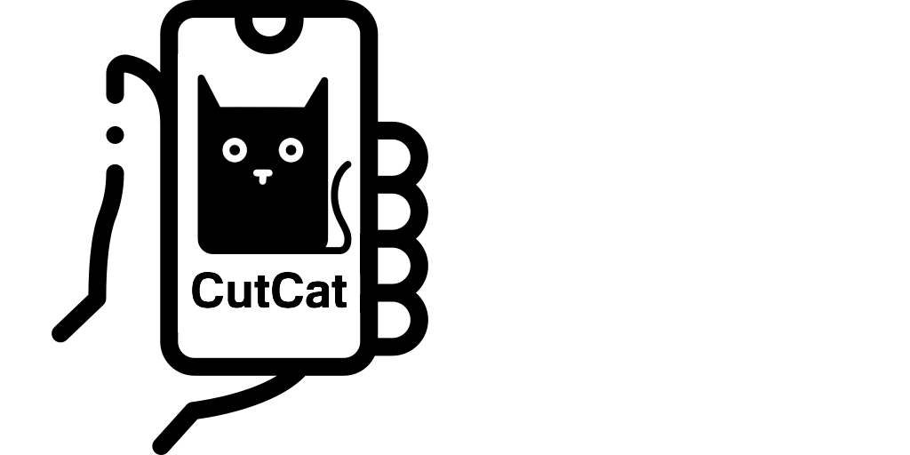

# CutCat

CutCat is an app that lets you copy objects from real life and directly paste them on a background using the magic of [OpenCV SIFT](https://docs.opencv.org/master/da/df5/tutorial_py_sift_intro.html) and a pre-trained [U^2 Net model](https://github.com/xuebinqin/U-2-Net) 
## Video demo

https://user-images.githubusercontent.com/33237270/128265329-21e9d5a4-ab36-4bab-8735-88607656f053.mp4

## General Architecture


## How to use ?
Everything you need to run CutCat is already dockerized and ready to go.

1. Clone the repo
```bash
git clone git@github.com:ansnoussi/CutCat.git && cd CutCat
```
2. Run all the backend services (Running this for the first time will take a while to pull the docker images)
```bash
docker-compose up
```
3. Now that everything is running, grab the ip of the gunicorn application server
```bash
docker inspect -f '{{range.NetworkSettings.Networks}}{{.IPAddress}}{{end}}' cutcat-web
```
and replace it in the React Native app in `mobile-client/Components/Main.js` in line 47 `const SERVER_IP = "192.168.1.19"`

4. Start the React Native app using 
```bash
cd mobile-client && expo start
```
and navigate to `http://localhost:5000` in your web browser to start using CutCat.
## Want to contribute ?
This was a side project that I finished in parallel with other side projects and a full-time job, so it's far from perfect :
- the flask server is extensivly using slow file i/o
- image resizing/compressing could be done in React Native to reduce execution time
- the UI could benefit from some changes
- ...

so any contribution will be appreciated, just open a PR and I will be more than happy to respond.
